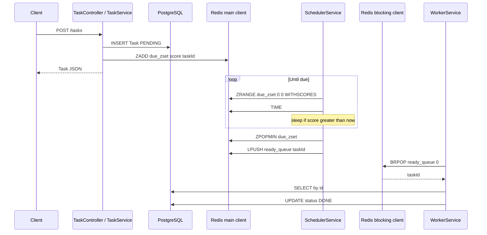
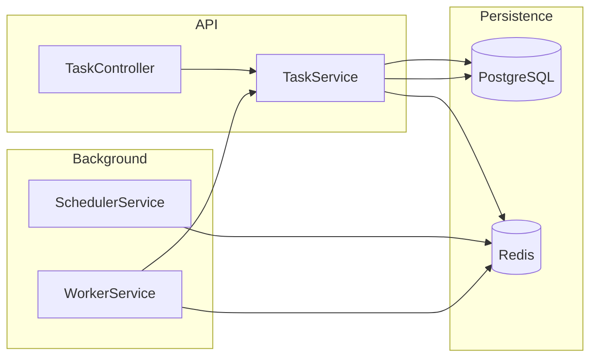

# Scheduler App — Architecture

NestJS service that schedules tasks **without cron**: due times live in **Redis** (sorted set + list), a **scheduler loop** moves work when it is due, and a **worker** executes jobs and updates **PostgreSQL**.

---

## How it works

This section is the **operational walkthrough**: what runs when the process starts, how a task gets from the API to `DONE`, and how Redis commands fit together.

### Big picture (three moving parts)

After Nest boots, **three cooperating loops** share one Postgres database and one Redis server:

1. **HTTP API** — when someone calls `POST /tasks`, the app writes a **row** (`Task`, `PENDING`) and a **Redis sorted-set entry** whose **score** is “run at this Unix second,” **member** is the task’s UUID.
2. **Scheduler** — a never-ending loop peeks the **soonest** entry in that sorted set. Until **Redis time** catches the score, it only sleeps and peeks again. When **now ≥ score**, it **removes** that entry and **pushes** the UUID onto a **Redis list** (the “ready” handoff).
3. **Worker** — another loop **blocks** on that list (`BRPOP`). When an id appears, it loads the row from Postgres, runs your **effect** (today: logging / placeholder), then sets **`DONE`**.

There is **no cron expression** and no `@Cron` job: “when to run” is literally **compare stored seconds to current seconds** (scheduler uses Redis `TIME` so it matches Redis’s clock).

### When the application starts

1. `RedisService` constructs **two TCP connections** to Redis: one for normal commands, one **only** for blocking `BRPOP` (see [Redis connections](#redis-connections-important)).
2. `SchedulerService` `onModuleInit` starts `loop()` **without awaiting** it — the loop runs in the background until shutdown.
3. `WorkerService` does the same for its worker loop.

If the sorted set is empty, the scheduler still spins: it sleeps **1 second** between peeks so it does not busy-loop the CPU.

### Step A — Client creates a task (`POST /tasks`)

| Step | What happens |
|------|----------------|
| 1 | `ValidationPipe` + `CreateTaskDto` validate `userId`, `message`, `executeAt`, optional `timeZone`. |
| 2 | `parseExecuteAtToUtcDate` turns `executeAt` (+ optional `timeZone`) into one **UTC `Date`** (Luxon). |
| 3 | TypeORM **`save`** inserts `tasks` row: `id` (UUID), `executeAt` (`timestamptz`), `status = PENDING`. |
| 4 | The service recomputes **epoch seconds** from **`saved.executeAt`** (what Postgres actually stored) and checks it is **≥ Redis `TIME` + 3 seconds**; otherwise it returns **400** (would run “immediately” or in the past). |
| 5 | **`ZADD`** on `scheduler:app:due_zset`: **member** = task UUID, **score** = that epoch second. |

The HTTP response returns the new task; **nothing is marked `DONE` yet** — that happens only after the worker runs.

### Step B — Scheduler moves “due” work to the ready list

All of this uses the **main** Redis client (`getClient()`):

1. **`ZRANGE scheduler:app:due_zset 0 0 WITHSCORES`** — read only the **single smallest score** element (next due). Redis returns **`[member, score]`** pairs; the code reads **`score` from index 1** (not index 0 — that is the UUID).
2. **Empty set** → sleep 1s, go to step 1.
3. **Invalid score** → remove that member with `ZREM`, continue.
4. **`TIME`** on Redis → current **`now`** in whole seconds.
5. If **`score > now`** → task is still in the future: sleep **`min((score - now) × 1000 ms, 5000 ms)`** (capped so the process stays responsive), then go to step 1.
6. If **`score ≤ now`** → task is due: **`ZPOPMIN`** (atomic remove of lowest), then **`LPUSH scheduler:app:ready_queue <taskId>`**.

Each iteration is wrapped in **try/catch** so one bad Redis error (e.g. wrong key type during migration) logs and backs off instead of killing the scheduler forever.

### Step C — Worker executes and flips status

Uses the **blocking** Redis client (`getBlockingClient()`):

1. **`BRPOP scheduler:app:ready_queue 0`** — wait until the list has data; returns **`[key, taskId]`**.
2. **`findOne(taskId)`** in Postgres. Missing row → warn (stale Redis id) and return to step 1.
3. Placeholder “do the work” (notifications, etc.).
4. **`markDone`** — load entity, set `DONE`, `save` to Postgres.

Then the worker immediately **blocks again** on `BRPOP` for the next id.

**Status:** `PENDING` from create until the worker finishes; only then does the row become `DONE`.

### Sequence diagram (happy path)



### Why a sorted set *and* a list?

- **Sorted set (`due_zset`)** — Redis keeps members ordered by **score**; `ZRANGE 0 0` is always “who is next?” without scanning every task.
- **List (`ready_queue`)** — a simple **handoff buffer** between “time-based scheduling” and “do work now.” The scheduler only decides *when*; the worker only cares *what id to process next*.

---

## High-level diagram



---

## Module layout

| Module | Role |
|--------|------|
| **AppModule** | Boots `DatabaseModule` + `TasksModule`. |
| **DatabaseModule** (`@Global`) | `TypeOrmModule.forRoot` — Postgres connection and entity metadata. |
| **TasksModule** | Task HTTP API, domain services, TypeORM `Task` repository. Imports **RedisModule**. |
| **RedisModule** | Provides **RedisService** (exported). Imported only by `TasksModule` (not duplicated at app root). |

Folder shape (simplified):

```text
src/
  app.module.ts
  main.ts
  config/db/data-source.ts
  modules/
    database/database.module.ts
    redis/
      redis.module.ts
      domain/redis-keys.ts
      domain/services/redis.service.ts
    tasks/
      tasks.module.ts
      application/
        controllers/task.controller.ts
        dtos/create-task.dto.ts
      domain/
        entities/task.entity.ts
        enums/task-status.enum.ts
        parse-execute-at.ts
        services/task.service.ts
        services/scheduler.service.ts
        services/worker.service.ts
```

---

## Redis data model

| Key | Type | Purpose |
|-----|------|---------|
| `scheduler:app:due_zset` | **Sorted set (ZSET)** | **Score** = due time (Unix seconds). **Member** = task UUID. |
| `scheduler:app:ready_queue` | **List** | FIFO-style handoff: scheduler **`LPUSH`**, worker **`BRPOP`** (right pop). |

Constants live in `src/modules/redis/domain/redis-keys.ts` so names stay stable and do not collide with legacy keys like `schedule` (which may have been a string in older experiments).

---

## Redis connections (important)

**RedisService** opens **two TCP connections** to the same host:

| Connection | Used for |
|------------|-----------|
| **Main** (`getClient()`) | `ZADD`, `ZRANGE`, `ZPOPMIN`, `LPUSH`, `TIME`, `ZREM`, … |
| **Duplicate** (`getBlockingClient()`) | **`BRPOP` only** |

**Why:** On a single ioredis connection, a blocking **`BRPOP`** holds the connection until data arrives. Any concurrent **`ZRANGE` / `ZADD`** on that same connection would be queued behind it and **never run**, deadlocking scheduling. The duplicate connection isolates blocking reads from the scheduler / writer traffic.

`maxRetriesPerRequest: null` is set on the main client so long-lived / blocking patterns behave predictably with ioredis.

---

## Time model — `executeAt`

Parsing is centralized in **`parseExecuteAtToUtcDate`** (`parse-execute-at.ts`) using **Luxon**.

| Client sends | Behavior |
|--------------|----------|
| ISO string with **`Z`** or **`±hh:mm` / `±hhmm`** | Treated as an **absolute instant** (UTC or fixed offset). |
| Civil datetime **without** zone suffix | Requires **`timeZone`** (IANA, e.g. `Asia/Dhaka`). Interpreted as **local wall time** in that zone, then converted to UTC for storage and Redis scoring. |

The API rejects schedules that are **already in the past** relative to **Redis `TIME`** (with a small minimum lead), so clients must send a **future** instant or local future time.

---

## PostgreSQL / TypeORM

- **Driver:** `pg`  
- **Entity:** `Task` — UUID `id`, `userId`, `message`, `executeAt` (`timestamptz`), `status`, `createdAt` (column `creation_date`).  
- **Config:** `src/config/db/data-source.ts` — host `localhost`, port **5433**, DB `schedulerDB` (matches typical `docker-compose` mapping).  
- **`synchronize: true`** in dev (schema auto-sync from entities; **not** recommended for production without migrations).

---

## HTTP surface

| Method | Path | Description |
|--------|------|---------------|
| `GET` | `/tasks` | List tasks (ordered by `createdAt` desc). |
| `POST` | `/tasks` | Create task + enqueue in Redis zset. |
| `DELETE` | `/tasks` | Clear all tasks (repository `clear`). |

Global **`ValidationPipe`** with **`whitelist: true`** strips unknown JSON properties.

---

## Performance and benefits vs cron

### Benefits compared to traditional cron

| Topic | Cron-style (`crontab`, `@Cron`) | This app (Redis + loops) |
|--------|----------------------------------|---------------------------|
| **When jobs run** | Fixed calendar grid (e.g. every minute / `0 */6 * * *`). Each line is one pattern. | **Per-task wall time** — each row has its own `executeAt`; millions of different times are fine. |
| **Dynamic schedules** | Changing “next run” often means editing cron or many scheduled jobs. | **Insert / update / delete** tasks and Redis entries from the API or code — no crontab deploy. |
| **Coupling** | Depends on OS scheduler or a worker that interprets cron strings. | **In-process** with Nest: same binary handles HTTP + delay + execution (modulo scaling notes below). |
| **Visibility & ops** | Logs only when a tick fires; harder to see “what is queued.” | **Redis keys** expose backlog: `ZRANGE` on the zset shows *what* and *when*; `LLEN` on the ready list shows pending handoff. |
| **Execution model** | Often “wake everyone” on a tick even if nothing to do. | **Idle scheduler** sleeps **1s** when the zset is empty; when work exists but is future, sleep is **capped at 5s** per iteration so the loop stays cheap and responsive. |
| **Wake-to-work path** | Parse cron, compute next fire, sleep until then (or poll). | **O(log N)** Redis ops: `ZRANGE 0 0` is “next due”; `ZPOPMIN` + `LPUSH` is constant-time for one task; worker **`BRPOP`** is efficient blocking wait — no busy spin. |

Cron is excellent when you truly want **“every Tuesday at 02:00”** globally. This design is better when every user or entity has a **different** next run time (reminders, delayed jobs, per-tenant schedules).

### Performance characteristics (what to expect)

- **Sorted set operations** (`ZADD`, `ZRANGE` with small range, `ZPOPMIN`) are **logarithmic in the size of that set**, not in total Redis keys. For typical reminder volumes this stays very small.
- **Scheduler cost when idle** — at most one `ZRANGE` + optional `TIME` per second, plus a 1s sleep; CPU use is negligible.
- **Scheduler cost when work is due soon** — bounded wakeups: waits at most **5 seconds** toward the next due time per loop, then re-reads Redis (handles new tasks and clock skew without sleeping until the exact second in one giant sleep).
- **Worker** — **`BRPOP`** does not poll; it blocks on the server until data exists, so an idle worker does not hammer Redis or CPU.
- **End-to-end latency after due time** — bounded by that **5s** scheduler cap plus worker pickup; not sub-millisecond unless you tighten sleeps or switch to a blocking primitive like **`BZPOPMIN`** (trade-off: more moving parts).

### Where cron can still win

- **Sub-second or hard real-time** guarantees — cron + dedicated worker can be simpler to reason about than poll caps.
- **Very large clusters** — one scheduler loop per app instance needs **coordination** (locks, leader election, or Redis Streams consumer groups) so two nodes do not double-dispatch the same task. A single **central cron** firing a queue is a familiar pattern at huge scale.
- **Regulatory / ops preference** — some teams want schedules **only** in `crontab` or an external scheduler (Airflow, K8s CronJob) for auditability.

### Trade-off summary (this codebase)

The current scheduler is **single-process**, simple, and **good for moderate load and arbitrary per-task times**. Horizontal scaling of *the scheduler itself* is left as a future improvement (see [Extension points](#extension-points-todos-in-code)).

---

## Local dependencies

Typical `docker-compose` provides:

- **Postgres** — e.g. `localhost:5433` → container `5432`.  
- **Redis** — e.g. `localhost:6379`.

Application listens on **port 3000** (`main.ts`). Redis host/port are **hardcoded** in `RedisService` for local dev; production should move them to **environment variables** / Nest `ConfigModule`.

---

## Extension points (TODOs in code)

- **Worker:** integrate email / push / SMS after `findOne`.  
- **Resilience:** multi-instance scheduler, dead-letter queue, retries, metrics.  
- **Config:** externalize DB/Redis URLs and disable `synchronize` in prod with migrations.

---

## Related files (quick reference)

| Concern | File |
|---------|------|
| Redis keys | `src/modules/redis/domain/redis-keys.ts` |
| Dual Redis clients | `src/modules/redis/domain/services/redis.service.ts` |
| Schedule loop | `src/modules/tasks/domain/services/scheduler.service.ts` |
| Consume ready queue | `src/modules/tasks/domain/services/worker.service.ts` |
| Create + validate time + `ZADD` | `src/modules/tasks/domain/services/task.service.ts` |
| `executeAt` parsing | `src/modules/tasks/domain/parse-execute-at.ts` |
| HTTP DTO | `src/modules/tasks/application/dtos/create-task.dto.ts` |
